# AgileTribers Task 2

## Exercises

| Exercise | Screenshot |
|----------|------------|
| [Exercise 1](ex1.html) | 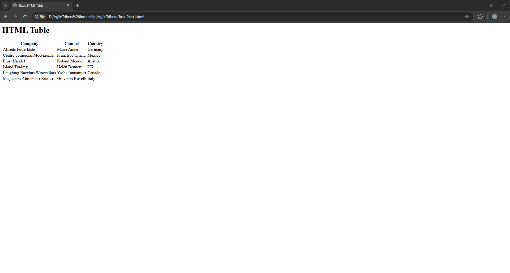 |
| [Exercise 2](ex2.html) | 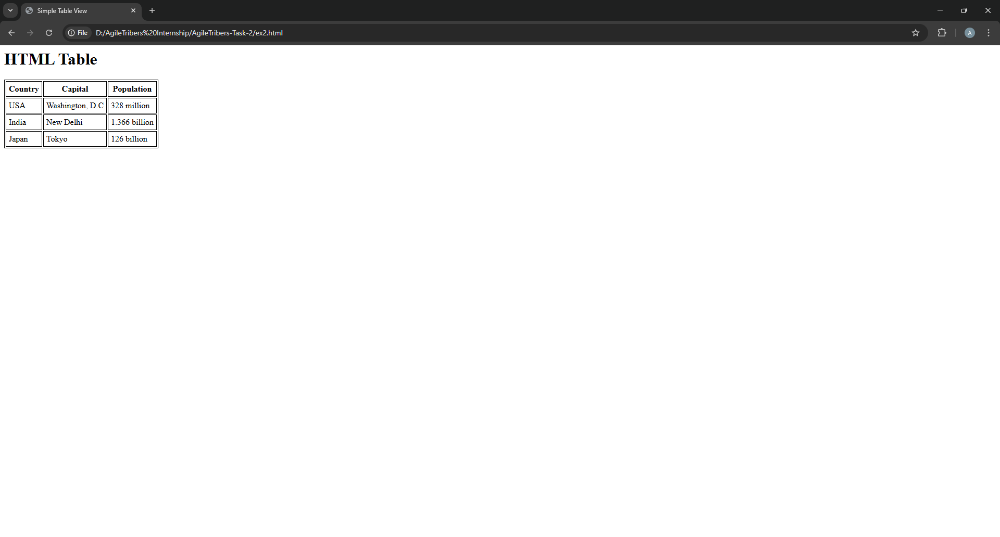 |
| [Exercise 3](ex3.html) | 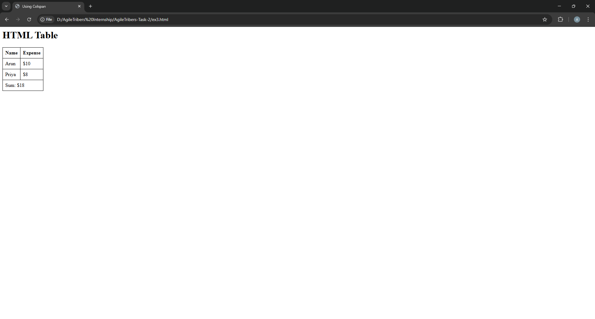 |
| [Exercise 4](ex4.html) | 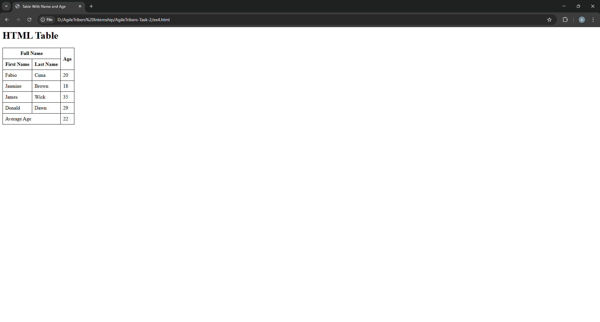 |
| [Exercise 5](ex5.html) | 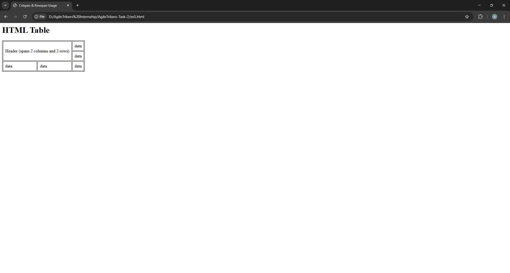 |
| [Exercise 6](ex6.html) | 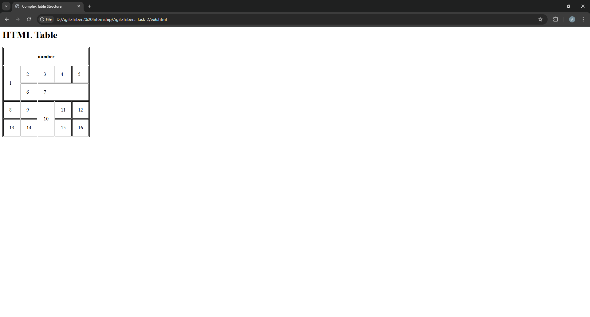 |
| [Exercise 7](ex7.html) | 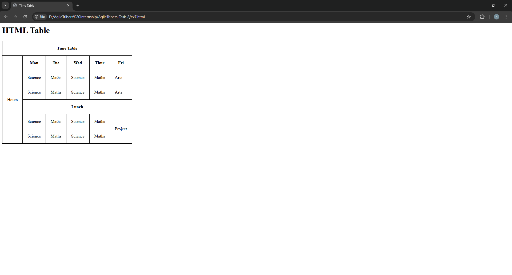 |
| [Exercise 8](ex8.html) | 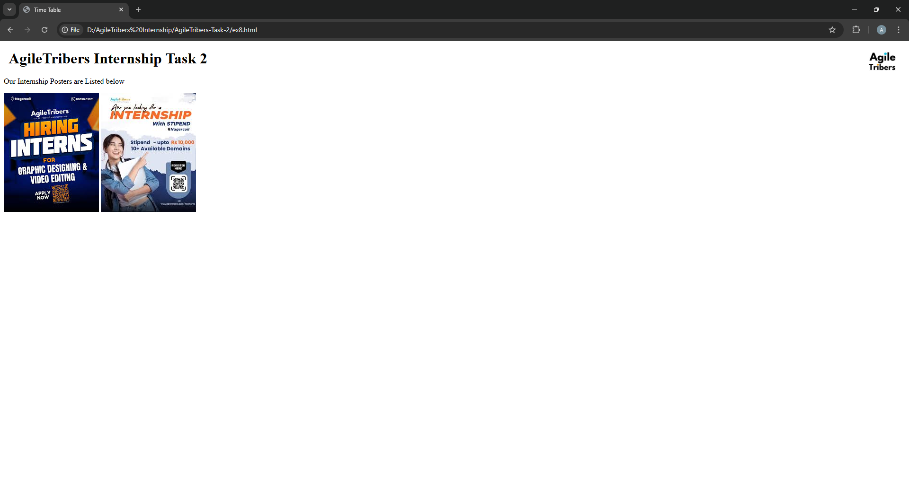 |
| [Exercise 9-12](ex9,10,11,12.html) | 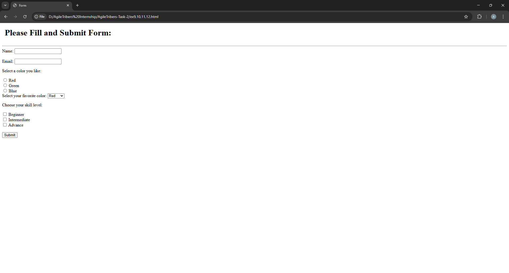 |
| [Exercise 13](ex13.html) | 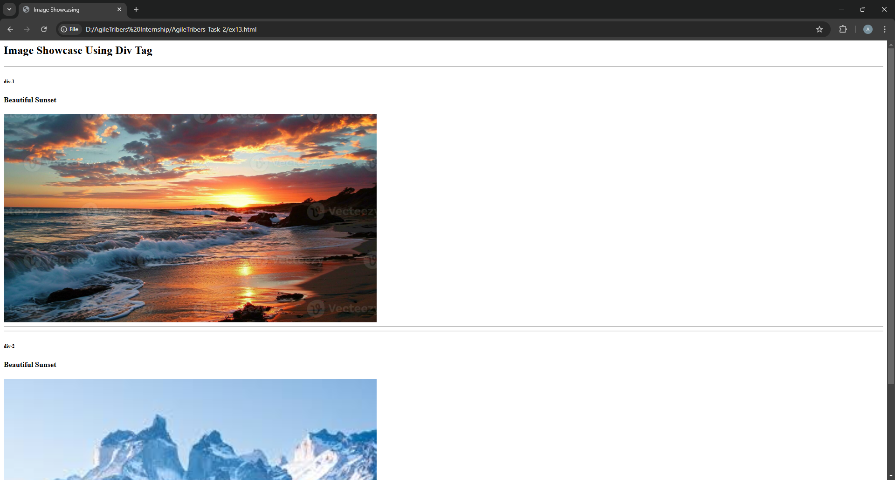 |
| [Exercise 14](ex14.html) | 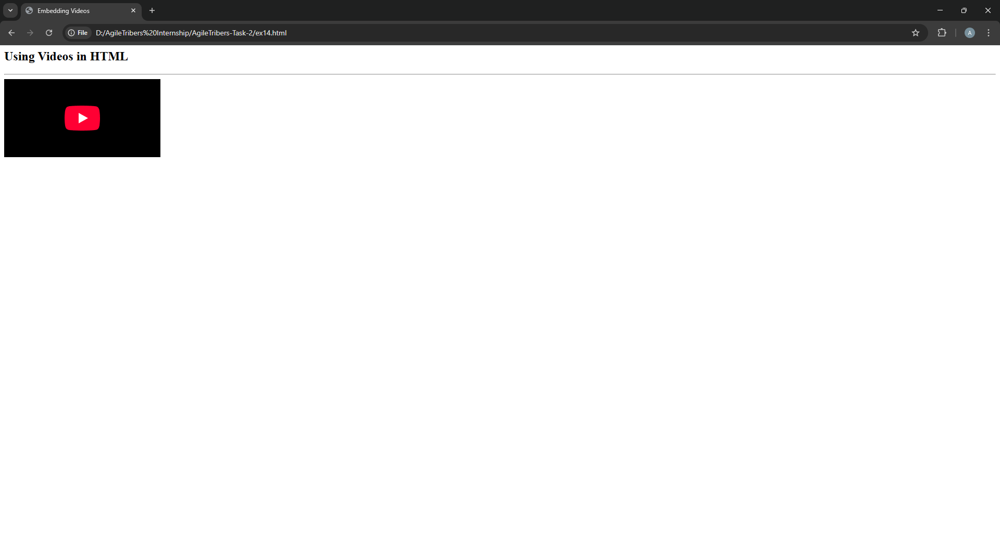 |
| [Exercise 15](ex15.html) | 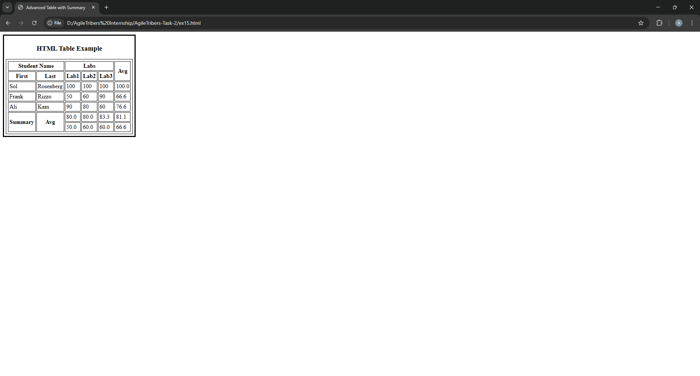 |
